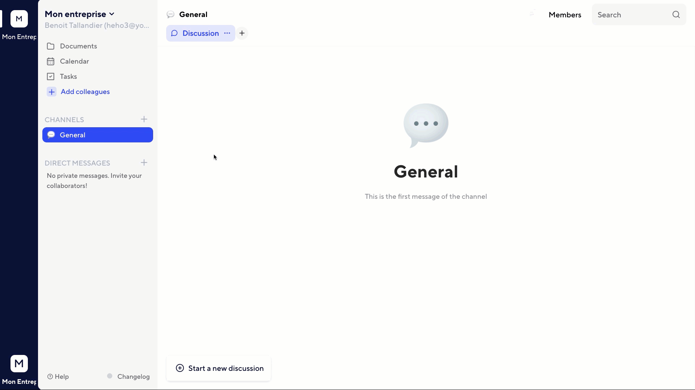

# Rights

Twake has several levels of rights. Users belong to one or more workspaces within the company. They can have different statuses inherent to their membership to the company or workspace

## Owner

He's the main administrator of the whole company. He can: 

* Allow connectors and applications to be installed in workspaces 
* Change the corporate identity 
* Giving/withdrawing the right "Owner of the company" to a member of the company 

The creator of the company is the only owner. You can not change this role. Only the creator can be owner of the company.

## Admin

An admin has the same right than the owner. He can: 

* Allow connectors and applications to be installed in workspaces 
* Change the corporate identity 
* Giving/withdrawing the right "Owner of the company" to a member of the company 

The creator of the company is the only owner. You can not change this role. Only the creator can be owner of the company.

To grant the admin right, open the console \([https://console.twake.app](https://console.twake.app)\). Open `Users` section and `Edit` the member you want to set admin. Update the Role with `Admin` and save.

## Workspace administrator

He's the team administrator. He has the same rights as a user. In addition, he can: 

* Add/remove connectors and applications in the workspace
* Changing the identity of the workspace 
* Adding members to the workspace 
* Delete workspace 

By default, the creator of the workspace is the administrator. This right can be cumulated with that of a company administrator.

To grant the workspace level, open your workspace collaborators page, and select `Administrator` 

## User

The "user" right is the default right of a member in a workspace. It can : 

* Read and send messages to public and private chat channels \(to which he has been invited\) 
* Create, modify, delete documents from the drive 
* Create, edit, delete events and calendars 
* Create, modify, delete tables and tasks Invite users to the workspace 
* Create a workspace within the company

It's a default right. If the collaborator is not Company or Workspace administrator and he is not a Guest user, he is a simple User

## Guest

This status is intended for external partners working on a specific topic with the team. Guest user can :

* Talk in the channel where they are invited

They can not join by themself any channel \(even public\). They need to be invited by a normal user.

To set the Guest level, open the console \([https://console.twake.app](https://console.twake.app)\) and the users page. Set the user's role to "Guest".

